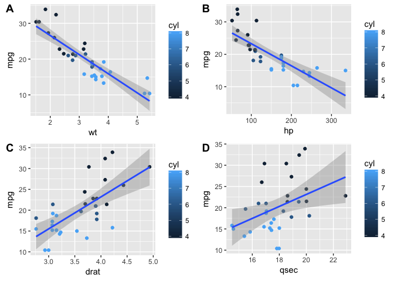

readme
================

R Functional Programming, inspired by [plotcon talk](https://rstudio-pubs-static.s3.amazonaws.com/237010_6d37553296a34a6c899f2660911f1b17.html)
-----------------------------------------------------------------------------------------------------------------------------------------------

This repository is to practice R Functional Programming. It will consist of series of practices. In practice 1, the use of package [purrr](https://github.com/tidyverse/purrr), [tidyr](http://tidyr.tidyverse.org/) and [broom](https://cran.r-project.org/web/packages/broom/vignettes/broom.html) will be explored, to pass functions into data frame objects. Practice 2 I will practice the use of package [data.table](https://cran.r-project.org/web/packages/data.table/vignettes/datatable-intro.html) along with package broom. data.table is underrepresented package that not only gives wide variety of applications in data wrangling, but also gives users fast data processing speed.
The true value of using purrr::map to pass functions within data.frame objects is that passing around dynamic varible is possible. I havent succeeded to do the same with data.table objects, so any help on this will be welcomed

### Practice 1

Practice 1 starts with using nesting function tidyr::nest, to group rows within the same categories of 'cyl'

``` r
mtcars %>% group_by(cyl)%>%nest()
```

    ## # A tibble: 3 x 2
    ##     cyl               data
    ##   <dbl>             <list>
    ## 1     6  <tibble [7 x 10]>
    ## 2     4 <tibble [11 x 10]>
    ## 3     8 <tibble [14 x 10]>

definde function trait\_model

``` r
groupby_mtcars<-mtcars %>% group_by(cyl)%>%nest()

trait_model<-function(df,x.var,y.var){
  df %$%lm(.[[y.var]]~.[[x.var]])  
}
```

And use purrr::map to 1. pass function trait\_model to the dataframe colum 'data' create new column 'model', 2. then to pass function broom::glance to the column 'model' for creating another new column 'summary'.

``` r
groupby_mtcars %<>% 
  mutate(
    
    model=data%>%map(trait_model,"wt","mpg"),
    summary=model%>%map(broom::glance)
    
    
  )
```

Now groupby\_mtcars looks like this:

``` r
groupby_mtcars %>% head
```

    ## # A tibble: 3 x 4
    ##     cyl               data    model               summary
    ##   <dbl>             <list>   <list>                <list>
    ## 1     6  <tibble [7 x 10]> <S3: lm> <data.frame [1 x 11]>
    ## 2     4 <tibble [11 x 10]> <S3: lm> <data.frame [1 x 11]>
    ## 3     8 <tibble [14 x 10]> <S3: lm> <data.frame [1 x 11]>

### Passing dynamic variables to dynamic functions

The use of purrr:map on data.frame has particular advantage to pass dynamic variables for models. For example, say we want to build linear model where the response variable is mpg, with mulitple explanatory varibles:

``` r
var.list=c("wt","hp","drat","qsec") #passing variables 
```

Now, we are going to create a list instead of a data frame, or a data table, to store multiple models:

``` r
model_mtcars<-list() #create a list to store data
```

Next, we are going to pass those variables on the list to build multiple models using function: trait\_model

``` r
groupby_mtcars<-mtcars %>% group_by(cyl)%>%nest()
for (v in var.list){
  
  model_mtcars[[v]]<-groupby_mtcars %>% 
  mutate(
    
    model=data%>%map(trait_model,v,"mpg"),
    glance=model%>%map(broom::glance),
    tidy   = map(model, broom::tidy)
    
    
  )
  model_mtcars[[v]]$modelxy<-sprintf("mpg~%s",v)
}

model_mtcars
```

    ## $wt
    ## # A tibble: 3 x 6
    ##     cyl               data    model                glance
    ##   <dbl>             <list>   <list>                <list>
    ## 1     6  <tibble [7 x 10]> <S3: lm> <data.frame [1 x 11]>
    ## 2     4 <tibble [11 x 10]> <S3: lm> <data.frame [1 x 11]>
    ## 3     8 <tibble [14 x 10]> <S3: lm> <data.frame [1 x 11]>
    ## # ... with 2 more variables: tidy <list>, modelxy <chr>
    ## 
    ## $hp
    ## # A tibble: 3 x 6
    ##     cyl               data    model                glance
    ##   <dbl>             <list>   <list>                <list>
    ## 1     6  <tibble [7 x 10]> <S3: lm> <data.frame [1 x 11]>
    ## 2     4 <tibble [11 x 10]> <S3: lm> <data.frame [1 x 11]>
    ## 3     8 <tibble [14 x 10]> <S3: lm> <data.frame [1 x 11]>
    ## # ... with 2 more variables: tidy <list>, modelxy <chr>
    ## 
    ## $drat
    ## # A tibble: 3 x 6
    ##     cyl               data    model                glance
    ##   <dbl>             <list>   <list>                <list>
    ## 1     6  <tibble [7 x 10]> <S3: lm> <data.frame [1 x 11]>
    ## 2     4 <tibble [11 x 10]> <S3: lm> <data.frame [1 x 11]>
    ## 3     8 <tibble [14 x 10]> <S3: lm> <data.frame [1 x 11]>
    ## # ... with 2 more variables: tidy <list>, modelxy <chr>
    ## 
    ## $qsec
    ## # A tibble: 3 x 6
    ##     cyl               data    model                glance
    ##   <dbl>             <list>   <list>                <list>
    ## 1     6  <tibble [7 x 10]> <S3: lm> <data.frame [1 x 11]>
    ## 2     4 <tibble [11 x 10]> <S3: lm> <data.frame [1 x 11]>
    ## 3     8 <tibble [14 x 10]> <S3: lm> <data.frame [1 x 11]>
    ## # ... with 2 more variables: tidy <list>, modelxy <chr>

``` r
model_mtcars<-do.call("rbind",model_mtcars)
model_mtcars
```

    ## # A tibble: 12 x 6
    ##      cyl               data    model                glance
    ##  * <dbl>             <list>   <list>                <list>
    ##  1     6  <tibble [7 x 10]> <S3: lm> <data.frame [1 x 11]>
    ##  2     4 <tibble [11 x 10]> <S3: lm> <data.frame [1 x 11]>
    ##  3     8 <tibble [14 x 10]> <S3: lm> <data.frame [1 x 11]>
    ##  4     6  <tibble [7 x 10]> <S3: lm> <data.frame [1 x 11]>
    ##  5     4 <tibble [11 x 10]> <S3: lm> <data.frame [1 x 11]>
    ##  6     8 <tibble [14 x 10]> <S3: lm> <data.frame [1 x 11]>
    ##  7     6  <tibble [7 x 10]> <S3: lm> <data.frame [1 x 11]>
    ##  8     4 <tibble [11 x 10]> <S3: lm> <data.frame [1 x 11]>
    ##  9     8 <tibble [14 x 10]> <S3: lm> <data.frame [1 x 11]>
    ## 10     6  <tibble [7 x 10]> <S3: lm> <data.frame [1 x 11]>
    ## 11     4 <tibble [11 x 10]> <S3: lm> <data.frame [1 x 11]>
    ## 12     8 <tibble [14 x 10]> <S3: lm> <data.frame [1 x 11]>
    ## # ... with 2 more variables: tidy <list>, modelxy <chr>

``` r
model_mtcars%>%unnest(glance)
```

    ## # A tibble: 12 x 16
    ##      cyl               data    model                 tidy  modelxy
    ##    <dbl>             <list>   <list>               <list>    <chr>
    ##  1     6  <tibble [7 x 10]> <S3: lm> <data.frame [2 x 5]>   mpg~wt
    ##  2     4 <tibble [11 x 10]> <S3: lm> <data.frame [2 x 5]>   mpg~wt
    ##  3     8 <tibble [14 x 10]> <S3: lm> <data.frame [2 x 5]>   mpg~wt
    ##  4     6  <tibble [7 x 10]> <S3: lm> <data.frame [2 x 5]>   mpg~hp
    ##  5     4 <tibble [11 x 10]> <S3: lm> <data.frame [2 x 5]>   mpg~hp
    ##  6     8 <tibble [14 x 10]> <S3: lm> <data.frame [2 x 5]>   mpg~hp
    ##  7     6  <tibble [7 x 10]> <S3: lm> <data.frame [2 x 5]> mpg~drat
    ##  8     4 <tibble [11 x 10]> <S3: lm> <data.frame [2 x 5]> mpg~drat
    ##  9     8 <tibble [14 x 10]> <S3: lm> <data.frame [2 x 5]> mpg~drat
    ## 10     6  <tibble [7 x 10]> <S3: lm> <data.frame [2 x 5]> mpg~qsec
    ## 11     4 <tibble [11 x 10]> <S3: lm> <data.frame [2 x 5]> mpg~qsec
    ## 12     8 <tibble [14 x 10]> <S3: lm> <data.frame [2 x 5]> mpg~qsec
    ## # ... with 11 more variables: r.squared <dbl>, adj.r.squared <dbl>,
    ## #   sigma <dbl>, statistic <dbl>, p.value <dbl>, df <int>, logLik <dbl>,
    ## #   AIC <dbl>, BIC <dbl>, deviance <dbl>, df.residual <int>

``` r
model_mtcars%>%unnest(tidy)
```

    ## # A tibble: 24 x 7
    ##      cyl modelxy        term     estimate  std.error  statistic
    ##    <dbl>   <chr>       <chr>        <dbl>      <dbl>      <dbl>
    ##  1     6  mpg~wt (Intercept) 28.408844513 4.18436879  6.7892784
    ##  2     6  mpg~wt  .[[x.var]] -2.780105939 1.33491730 -2.0826054
    ##  3     4  mpg~wt (Intercept) 39.571196013 4.34658203  9.1039800
    ##  4     4  mpg~wt  .[[x.var]] -5.647025261 1.85011853 -3.0522505
    ##  5     8  mpg~wt (Intercept) 23.868029076 3.00546186  7.9415511
    ##  6     8  mpg~wt  .[[x.var]] -2.192437926 0.73923934 -2.9658026
    ##  7     6  mpg~hp (Intercept) 20.673851133 3.30442894  6.2564066
    ##  8     6  mpg~hp  .[[x.var]] -0.007613269 0.02657760 -0.2864543
    ##  9     4  mpg~hp (Intercept) 35.983025639 5.20129608  6.9180883
    ## 10     4  mpg~hp  .[[x.var]] -0.112775888 0.06118248 -1.8432709
    ## # ... with 14 more rows, and 1 more variables: p.value <dbl>

### Usage of model\_mtcars

Lots of potential here with this dataframe object! It includes data, model and summary all together within one chunck of table. Now model\_mtcars dataframe object which include data, model, and summary can be used to easily generate plots with all models that included in the dataset, without calling extra functions, using only ggplot and the dataframe object.For example,

``` r
model_mtcars$modelxy%>%unique->model.lists

Fig.bymodel<-list()
v=0;
for(model.name in model.lists){
  v=v+1
  y.name<-model.name%>%strsplit(.,"~")%>%.[[1]]%>%.[1]
  x.name<-model.name%>%strsplit(.,"~")%>%.[[1]]%>%.[2]
  Fig.bymodel[[v]]<-model_mtcars%>%filter(modelxy==model.name)%>%
    unnest(data)%>%
    ggplot(aes_string(x=x.name,y=y.name,color="cyl"))+geom_point()+geom_smooth(method="lm")
  
  
}

  cowplot::plot_grid(plotlist=Fig.bymodel,labels=c("A","B","C","D"))
```



Practice 2 starts with ...

``` r
mtcars %>%data.table %>%head
```

    ##     mpg cyl disp  hp drat    wt  qsec vs am gear carb
    ## 1: 21.0   6  160 110 3.90 2.620 16.46  0  1    4    4
    ## 2: 21.0   6  160 110 3.90 2.875 17.02  0  1    4    4
    ## 3: 22.8   4  108  93 3.85 2.320 18.61  1  1    4    1
    ## 4: 21.4   6  258 110 3.08 3.215 19.44  1  0    3    1
    ## 5: 18.7   8  360 175 3.15 3.440 17.02  0  0    3    2
    ## 6: 18.1   6  225 105 2.76 3.460 20.22  1  0    3    1

Note that the `echo = FALSE` parameter was added to the code chunk to prevent printing of the R code that generated the plot.
